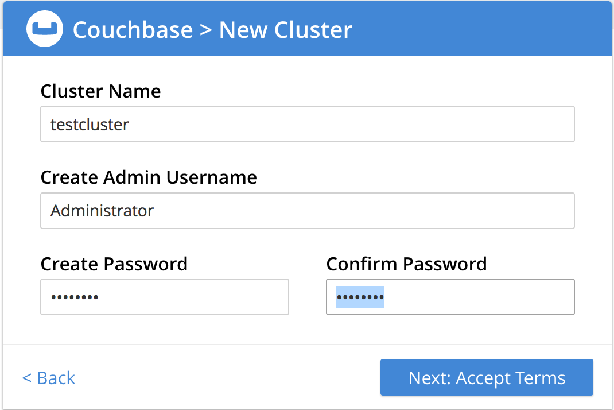
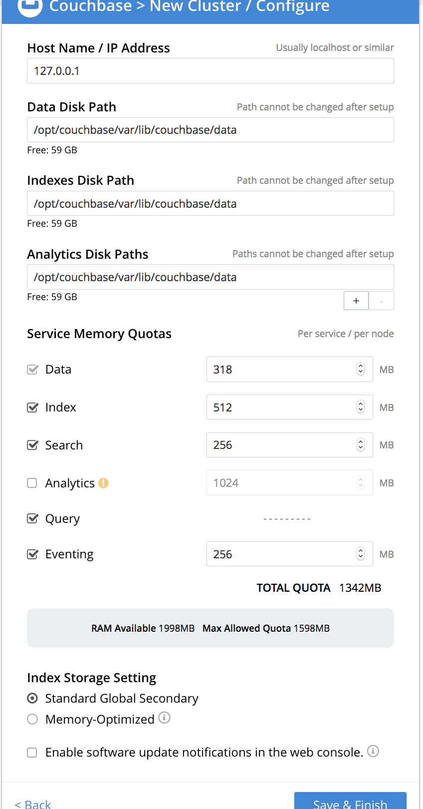
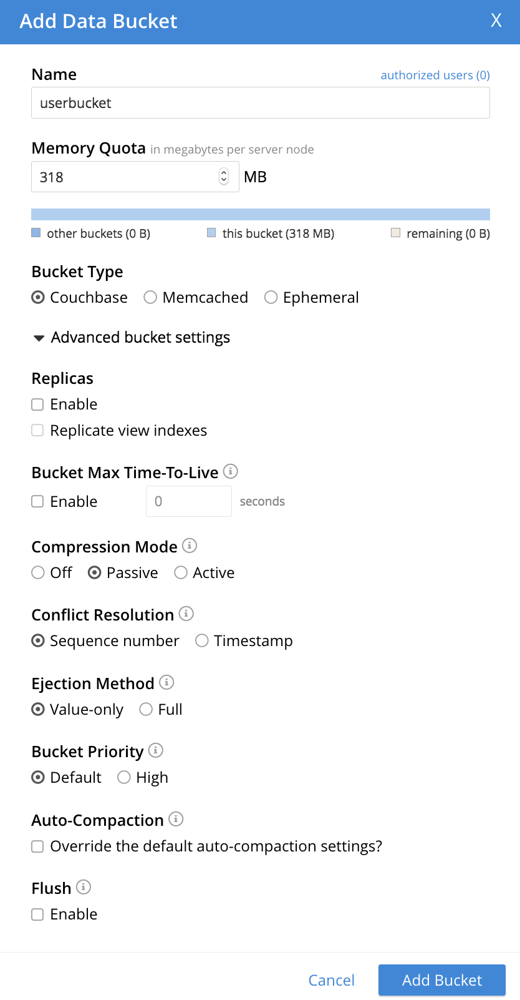
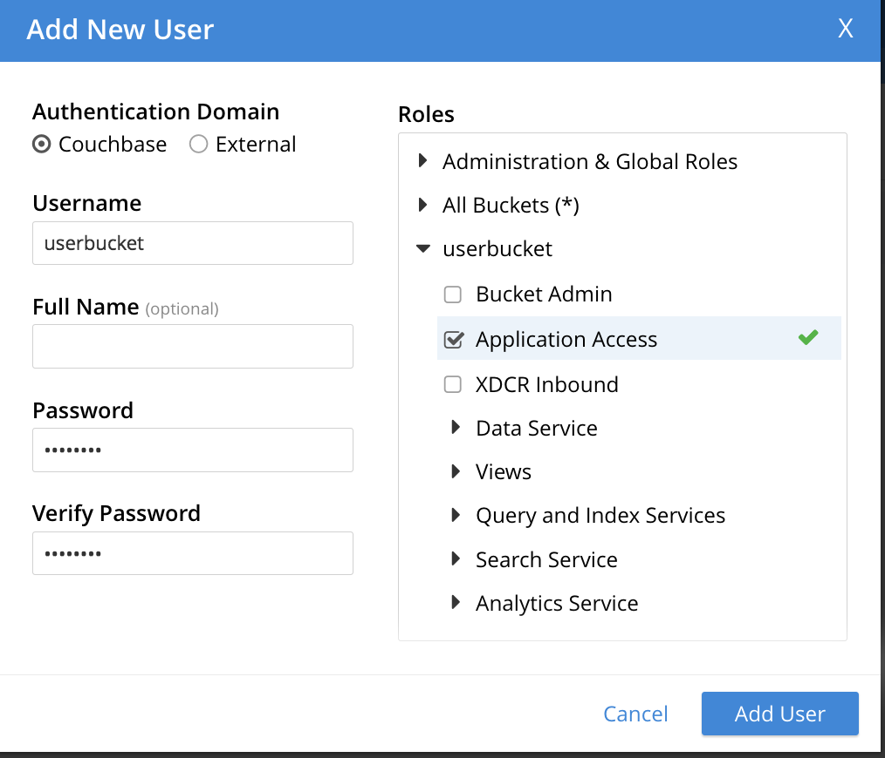

# springboot-couchbase
Simple CRUD operations leveraging Springboot & Couchbase

# Couchbase Docker setup
Pull the [Couchbase Docker image](https://hub.docker.com/r/couchbase/server/) from docker hub

```sh
docker run -d --name db -p 8091-8094:8091-8094 -p 11210:11210 couchbase
```


Setup new cluster
---
Navigate to http://localhost:8091/ui/index.html



Cluster configuration
---
Default settings should be fine



Add Bucket
---
Default settings should be fine



Add User
---
> Username and name of the bucket should be the same




CRUD Operations
---

Create
```sh
curl -H "Accept: application/json" -H "Content-type: application/json" -XPOST -d '{"userId":"rick", "firstName":"rick", "lastName":"van", "email":"rick@gc.com"}' http://localhost:8080/users;echo
```

Read
```sh
curl -XGET -H 'Content-type: application/json' http://localhost:8080/users/rick;echo
```

Read All
```sh
curl -XGET -H 'Content-type: application/json' http://localhost:8080/users;echo
```

Update
```sh
curl -H "Accept: application/json" -H "Content-type: application/json" -XPATCH -d '{"lastName":"update last name"}' http://localhost:8080/users/rick;echo
```

Delete
```sh
curl -XDELETE http://localhost:8080/users/rick
```


